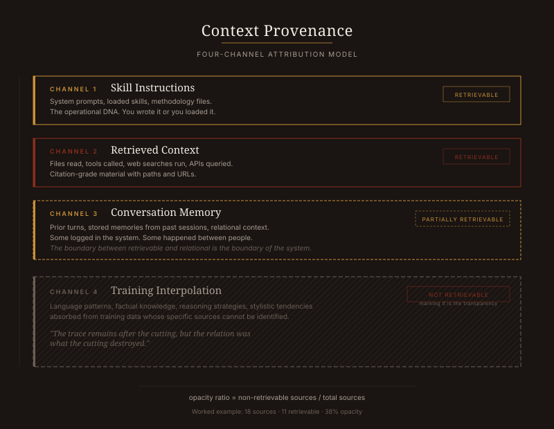
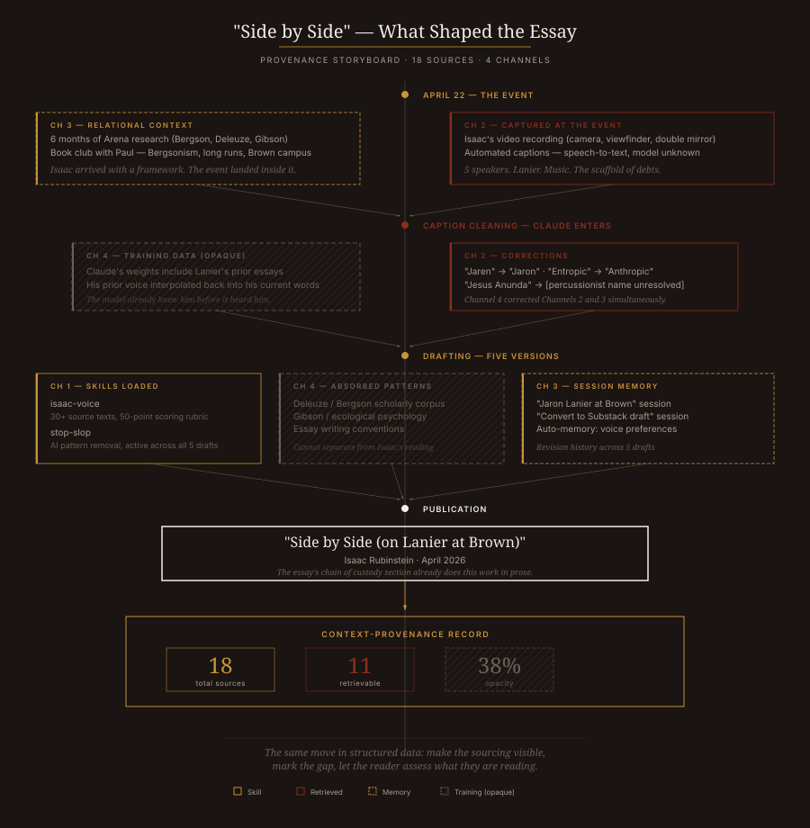
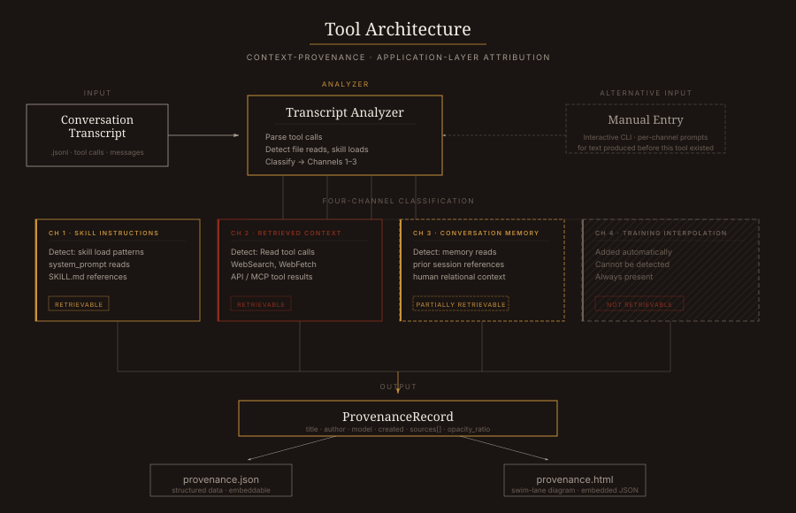

# Context Provenance

Four-channel attribution for AI-mediated text.

## The Problem

On April 22, 2026, Jaron Lanier spoke at Brown University. He proposed counterfactual cluster estimation: a parallel channel running alongside a language model that surfaces the training-data clusters most responsible for each response. The people whose words got interpolated to produce a sentence would stop being nameless.

Lanier had money for one extra summer intern on the problem.

This tool does not solve what Lanier identified. Nobody outside a foundation model lab can. What it does: track the sources that *are* retrievable, present them honestly in parallel, and mark the remainder as opaque. Three channels you can open. One you cannot. The four together constitute provenance.

## The Model



## The Four Channels

**Channel 1 — Skill Instructions.** System prompts, loaded skills, methodology files. The operational DNA shaping how the model behaves. Retrievable. You wrote it or you loaded it.

**Channel 2 — Retrieved Context.** Files read, tools called, searches run, APIs queried. Citation-grade material with paths and URLs. Retrievable. The model touched it during this conversation and you can go look at it yourself.

**Channel 3 — Conversation Memory.** Prior turns in the conversation, stored memories from past sessions, relational context that accumulated over time. Partially retrievable. Some of this was human conversation that happened outside any system.

**Channel 4 — Training Interpolation.** Everything else. Language patterns, factual knowledge, reasoning strategies, stylistic tendencies absorbed from training data whose specific sources cannot be identified from outside the model. Not retrievable. The channel is marked as present because marking it is the transparency. Bergson's point: you cannot reconstruct duration from its spatial trace. The trace remains after the cutting, but the relation was what the cutting destroyed.

## What This Produces

A provenance record (JSON) and a swim-lane diagram (HTML) showing all four channels for a piece of AI-mediated text. The JSON embeds in the HTML for programmatic access.

The worked example is the provenance for "Side by Side (on Lanier at Brown)," an essay about the event that prompted this tool. 18 sources identified. 11 retrievable. 38% opacity.



## Architecture



## Usage

**From a conversation transcript:**

```bash
python -m provenance analyze transcript.jsonl \
  --title "My Essay" \
  --author "Your Name" \
  --model "claude-opus-4-6" \
  --html
```

The analyzer parses tool calls, file reads, skill loads, and memory access from the transcript. Classifies each into Channels 1-3. Adds Channel 4 automatically.

**Manual entry (for text produced before this tool existed):**

```bash
python -m provenance manual \
  --title "Side by Side (on Lanier at Brown)" \
  --author "Isaac Rubinstein" \
  --model "claude-opus-4-6" \
  --html
```

Interactive prompts walk you through adding sources per channel.

**Render existing provenance as HTML:**

```bash
python -m provenance render provenance.json --output report.html
```

**Programmatic:**

```python
from provenance import ProvenanceRecord, Source, ChannelType, render_swimlane

record = ProvenanceRecord(
    title="My Essay",
    author="Your Name",
    created="2026-05-02",
    model="claude-opus-4-6",
)

record.add_source(Source(
    channel=ChannelType.RETRIEVED,
    label="research-paper.pdf",
    description="Primary source, read during drafting",
    path="~/Documents/research-paper.pdf",
    retrievable=True,
))

render_swimlane(record, "provenance.html")
```

## The Worked Example

The `examples/lanier-essay/` directory contains the full provenance for the essay that started this. Run it:

```bash
python examples/lanier-essay/build_provenance.py
```

This generates `provenance.json` and `provenance.html` showing every identifiable source across all four channels: the voice enforcement skills that shaped the drafting, the captions and research that fed the content, the conversation sessions and relationships that provided context, and the training data that cannot be opened.

The essay's own chain of custody section already did this work in prose. This tool does it in structured data. Both are the same move: making the sourcing visible so the reader can assess what they are reading and where it came from.

## Install

```bash
pip install -e .
```

No dependencies beyond Python 3.10+ standard library.

## What This Is Not

This is not Lanier's counterfactual cluster estimation. That requires access to model internals (attention weights, activation patterns, training data indices). It is a prototype of application-layer provenance: tracking what is knowable from outside the model, presenting it in parallel, and marking the rest as a gap.

The gap is the point. Channel 4 is present in every record and cannot be filled. Its presence is the honesty. If you could open Channel 4, you would not need Channels 1-3. The fact that you cannot is what makes the other three worth building.

## Intellectual Context

Henri Bergson argued that the intellect spatializes duration: it takes continuous, irreversible process and cuts it into discrete, reversible units. That cutting makes measurement possible and extraction possible in the same stroke. You cannot capture what you cannot cut, and what you capture by cutting is never the thing you cut it from.

James Gibson named what resists the cut: an affordance, information that exists only in the relation between a body and an environment and only while the body is acting. Stop the action and the affordance disappears.

Lanier's counterfactual cluster estimation tries to reconstruct the relational history that the model erased. This tool takes the more limited position: mark where the erasure happened. The parallel channel is not reconstruction. It is an honest map of what was lost.

The claim, if there is one: application-layer provenance is a meaningful partial solution to the attribution problem, not because it solves what Lanier identified, but because it makes the unsolvable part visible.

## License

MIT

## Author

Isaac Rubinstein / [Rubinstein Productions](https://rubinsteinproductions.com)

Built with Claude (claude-opus-4-6, Anthropic). This README was drafted with AI assistance and voice-enforcement skills. Its provenance is itself a test case.
