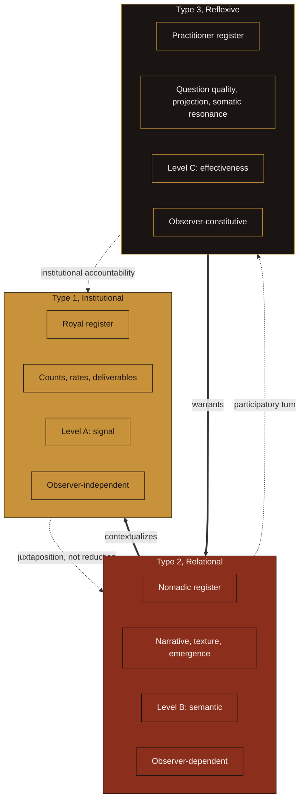

> **Canonical source:** `00 Canonical/RP Three-Type Information Architecture.md` in vault — last synced 2026-08-23. Edit there; this file is a snapshot for skills and public repo use.

# Three-Type Information Architecture
*The epistemological foundation of the Bilingual Dashboard*
*Authored 2026-05-09 | Read alongside: RP Measurement Framework, Nomadic Indicators Codebook, Say Why - Canonical Positioning & Skill Embedding*

---

## Purpose

The current RP Measurement Framework organizes measurement around two registers: Institutional (Royal) and Relational (Nomadic). The two-register system is operationally functional but theoretically incomplete. It presupposes a neutral observer producing both kinds of measurement, which conflicts with the methodology's own ontological foundation: that meaning arises in encounter, not in individuals; that the facilitator is constitutive of what is observed; that there is no view from nowhere.

This document specifies the **three-type architecture** that the methodology actually requires:

1. **Institutional Information**, what can be reported in the grammar of the funder
2. **Relational Information**, what the encounter reveals about the system
3. **Reflexive Information**, what the practitioner observes about their own observation

The third type is not a new addition. It is the explicit recovery of what was named "Contemplative Depth" in the original ENIF and silently deleted during the April 2026 consolidation. Its absence is the structural reason the framework feels theoretically thin to academic, philosophical, and STS readers.

This document does three things:

1. Defines each type, its ontological commitment, and its theoretical anchors in the existing research vault.
2. Specifies the translation logic, and its limits, between the three types.
3. Names what remains client-facing (the two-register Bilingual Dashboard) and what is internal methodology (the third type as backstop).

It is an internal canonical. The client-facing language remains Royal/Nomadic, integrated into the Bilingual Dashboard format described in RP Measurement Framework §5.

---

## 1. The three types

### 1.1 Type 1 - Institutional Information

**Definition.** Information about the program that can be expressed in the language of the funder, the board, the auditor. Counts, rates, durations, frequencies, ordinal scales, deliverables produced, dollars spent.

**Examples in current practice.** Customer Acquisition Cost; Net Promoter Score; Likert ratings of clarity, safety, satisfaction; asset utilization rates; decision-making latency; contract velocity; usage statistics.

**Shannon-Weaver level.** Level A, signal accuracy. The information is treated as if it were observer-independent: the rate is the rate regardless of who measures it.

**Ontological commitment.** The system being measured exists prior to and independent of the measurement. Properties of the system can be quantified without disturbing them. The measurer is interchangeable. This is the standard positivist commitment of public health surveillance and program reporting.

**Theoretical anchors (in-vault).**

- Standard validity theory (construct, content, ecological), implicitly underwriting all institutional metrics
- Results-Based Accountability ("How much? How well? Is anyone better off?"), operational backbone of the CPU-HEZ engagement
- Sullivan & Haley (2009) on multi-level assessment, used in the PPHC Data Academy practicum to keep findings within evidentiary scope
- Wilcoxon rank-based paired testing, used in PPHC under the documented n=5 constraint

**Practical instruments.** Airtable financial and outcome tables; Google Forms Likert distribution; NHTSA Countermeasures That Work as a domain reference (RIPCA); RBA scorecards.

**What it cannot do.** It cannot account for narrative coherence, relational quality, the emergence of insight, or the conditions under which measurement itself becomes possible. The inability is structural, not a defect to be repaired with better Type 1 instruments.

---

### 1.2 Type 2 - Relational Information

**Definition.** Information that exists only in the encounter. Between people, between an organization and its narrative, between the program and the population it serves. It cannot be extracted from the relational context that produces it without loss.

**Examples in current practice.** Consistency scores from the Three Consistency Questions; conversational texture (pause patterns, self-correction frequency, metaphor emergence, pronoun shifts); deterritorialization events; lines of flight; reterritorialization quality; the fear journey through four layers; relational field expansion and contraction.

**Shannon-Weaver level.** Level B, semantic precision. Bateson's "difference that makes a difference", information defined by its effect on the receiver, not by its objective signal properties.

**Ontological commitment.** The phenomenon being measured does not pre-exist the measurement. Three convergent claims from in-vault sources warrant this commitment:

- Following Mol's *The Body Multiple*: methods enact realities rather than describing them. The relational field is brought into existence by the act of attention paid to it.
- Following Barad's agential realism: the measurement device and the measured phenomenon are mutually constituted by the agential cut. There is no relational field independent of the cut that frames it.
- Following Wynter's sociogenic principle: any representation of the human encodes an ontological commitment about what kind of being humans are. To measure "engagement" is to enact a particular kind of human subject.

**Theoretical anchors (in-vault).**

- Bateson, "difference that makes a difference", multiple files including Recursive Visions, Second-Order Cybernetics and the Ecology of Mind and The Net of Indra in the Machine
- Nora Bateson on Warm Data as transcontextual information, Dark Matter Labs, Relational Metrics for Technology Assessment
- Annemarie Mol on method assemblage and ontological multiplicity, The Parliament of Things
- Karen Barad on intra-action and the agential cut, Agential Realism, Quantum Mechanics as Relational Ethico-Onto-Epistemology
- Sylvia Wynter on the sociogenic principle as counter-ontology to quantitative evaluation, The Sociogenic Turn (the most directly applicable text in the vault)
- Bruno Latour on translation as actor-network process, The Architecture of Association
- Floridi, MacKay, Dretske on semantic information, named in The Syntactic Severance
- Foucault on the examination as normalizing judgment, The Architecture of Control; the warrant for treating Type 1 as itself a contestable enactment rather than neutral measurement

**Practical instruments.** Nomadic Indicators Codebook (six coding domains: Consistency, Texture, Process, Fear, Somatic, Relational); the Three Consistency Questions matrix; transcript coding via the `nomadic-indicators-coder` skill; cross-stakeholder variance analysis through the `consistency-scoring-aggregator` skill.

**What it cannot do.** It cannot satisfy a funder request for attribution. It cannot replace Type 1 reporting in a compliance context. It does not answer "did the intervention work" in the language the institution expects.

---

### 1.3 Type 3 - Reflexive Information

**Definition.** Information about the practitioner's own observational position. What the facilitator notices about their own noticing, the quality of their attention, the projections they catch themselves making, the somatic resonance and dissonance that occurs in real time during the work.

**Examples in current practice (where this happens implicitly).** The Monthly Synthesis Ritual (RP Measurement Framework §7) Stage 4, Generator Integration: "Which projects energized vs. depleted? Where did I follow sacral response vs. mental override? How well did I honor latency periods? What shadows emerged?" The original ENIF Register 3 sub-indicators: question quality, projection management, deep listening ratio, shadow integration, methodology flexibility, bilingual translation facility.

**Shannon-Weaver level.** Level C, effectiveness. The information is constituted by its effect on the observer's subsequent action. This is the level Shannon explicitly bracketed and Weaver acknowledged could not be addressed without a theory of mind.

**Ontological commitment.** The observer is inside the system. Following von Foerster's second-order cybernetics: cybernetic principles apply to the act of observation itself; objectivity is a subject's delusion that observing can be done without him. Following Merleau-Ponty: the body is the primary site of knowing; intercorporeity precedes intersubjectivity. Following Varela, Thompson, and Rosch: cognition is enacted through embodied action; sense-making is a property of the autonomous observing system, not of an external reality being mirrored. Following Barad: the observer is part of the phenomenon, not external to it.

**Theoretical anchors (in-vault).**

- Heinz von Foerster on second-order cybernetics, Recursive Visions
- Maurice Merleau-Ponty on intercorporeity and the flesh of the world, The Flesh of the World
- Varela, Thompson, Rosch on enaction, The Enactive Approach, Mind as Life as World
- Neurophenomenology (Varela, Lutz) as the bridge between first-person experience and measurable correlate, The Architect and the Archaeologist
- Polyvagal theory repositioned from neuroanatomy to design principle, 2026-04-13-auto-research-polyvagal-controversy-mirror-leadership (the 39-expert critique and the pragmatic pivot)
- Foucault on the "care of the self" as practice rather than introspection, The Architecture of Control and The Neoliberal Self, Governmentality, Extraction

**Practical instruments.** The Monthly Synthesis Ritual Stage 4 (currently the primary Type 3 instrument, though not named as such); facilitation pre-session somatic check-in; post-session structured reflexive note (one paragraph capturing: question I asked that shifted the room; projection I caught; place I followed sacral vs. mental; shadow that surfaced); peer supervision when available; the narrative paragraph in the `consistency-scoring-aggregator` synthesis when written reflexively rather than descriptively.

**What it cannot do.** It cannot be reported as evidence to a funder in its raw form. It is the source from which other claims are warranted, not itself a deliverable claim. It is also the type most vulnerable to being mistaken for self-report data, which is Type 1 about the practitioner, not Type 3.

---

### 1.4 Summary table

| Property | Type 1: Institutional | Type 2: Relational | Type 3: Reflexive |
|---|---|---|---|
| **Current vocabulary** | Royal | Nomadic | (formerly Contemplative Depth, cut 2026-04) |
| **Shannon-Weaver level** | A, signal | B, semantic | C, effectiveness |
| **What it captures** | Counts, rates, deliverables | Narrative, texture, emergence | Practitioner's observation of observation |
| **Ontological status** | Observer-independent | Observer-dependent | Observer-constitutive |
| **Whose information is it?** | The system | The encounter | The practitioner |
| **Primary instrument** | Airtable, Likert, RBA | Nomadic Codebook, transcript coding | Monthly Synthesis Stage 4, supervision |
| **Audience** | Funder, board | Internal methodology + integrated client report | Internal only (warrant for other claims) |
| **Failure mode** | Reduction (mistakes the metric for the territory) | Capture (turns the encounter into a deliverable) | Solipsism (mistakes self-report for reflexivity) |

---

## 2. Visual map

The dotted arrows show translation moves between types. The bold arrows show the warrant relationship: Type 3 warrants Type 2, Type 2 contextualizes Type 1. A Type 1 finding without Type 2 contextualization is brittle. A Type 2 finding without Type 3 warrant is extractive.

---

## 3. Translation logic between the three types

The three types do not translate cleanly into each other. That is not a defect of the framework. It is the methodological claim. The translations that are possible operate under specific constraints. The translations that are not possible mark the boundary of each type's epistemic reach.

### 3.1 Type 1 → Type 2: juxtaposition, not reduction

A Type 1 metric (e.g., Likert "I felt seen" = 4.2) cannot be reduced to a Type 2 finding (e.g., a Deterritorialization event in the same session). The Likert is a syntactic compression of an experience that Type 2 captures in its structure.

**What is possible:** juxtaposition. The Bilingual Dashboard already does this. Likert scores are presented alongside narrative analysis. The two contextualize each other without either being derived from the other. Following Mol: these are different enactments of the same engagement, each with its own truth conditions.

**What is not possible:** reduction in either direction. You cannot derive narrative coherence from Likert means, and you cannot derive an NPS from a transcript coding. Mixed-methods designs that attempt this reduction (sequential explanatory, sequential exploratory) treat the qualitative as illustration of the quantitative or vice versa. The Bilingual Dashboard refuses both moves. The 2026 AEA proposal already names this: "Mixed methods asks the qualitative to translate into the quantitative or sit beside it as illustration. The Bilingual Dashboard refuses both moves."

### 3.2 Type 2 → Type 3: the participatory turn

A Type 2 finding (e.g., a CONSISTENCY-SHIFT marker in the participant's speech) becomes Type 3 when the practitioner asks: *what did I do, just before that shift, that changed the conditions in the room?* The Type 2 observation is data about the encounter. The Type 3 observation is data about the practitioner's contribution to the encounter.

**What is possible:** structured reflexive inquiry. The Monthly Synthesis Ritual Stage 4 ("Generator Integration") is the existing operational form. A pre-session somatic check-in plus a post-session reflexive paragraph (question I asked that shifted the room; projection I caught; place I followed sacral vs. mental; shadow that surfaced) would extend this into per-session practice.

**What is not possible:** collapsing the practitioner's reflexive observation into the participant's experience. The participant's experience of the engagement is Type 2. The practitioner's experience is Type 3. Conflating them is the failure mode of solipsistic facilitation, where the facilitator's felt sense substitutes for the participant's reported experience.

This is the territory where the Indigenous methodological lineage anchors the architecture's accountability claim. Wilson's four Rs, relational accountability, respectful representation, reciprocal appropriation, rights and regulation (*Research is Ceremony*, 2008), provide the axiology that elevates the Type 2 → Type 3 move from optional practitioner reflection to ethical obligation. In Wilson's terms, a Type 2 finding produced without Type 3 reflexive accountability is extractive: it takes relational information from the encounter without the researcher acknowledging their constitutive role in producing it. Smith's *Decolonizing Methodologies* (1999/2012) provides the extraction critique and the taxonomy of accountable research practices that operationalize the standard. See Indigenous Methodology for the full integration. Note that citation is not relationship, these methodologies require relational practice with Indigenous communities, not only bibliographic incorporation, and the present framework engages them as theoretical anchors without claiming co-investigator presence.

### 3.3 Type 3 → Type 1: institutional accountability

A Type 3 observation cannot itself be reported to a funder. But it warrants the production of Type 1 indicators that a funder can read.

**What is possible:** methodological transparency. The reflexive observation ("I noticed I was steering the participant toward a more institutionally legible framing of their experience") becomes part of the methodology section of the report, a statement of how the observed Type 1 metric was produced, what choices the practitioner made, what was excluded by the agential cut. This is what Barad calls response-ability: accountability for what the cut excludes.

**What is not possible:** presenting Type 3 raw to an institutional audience. "I felt depleted by this engagement" is not a finding about the program. It is information about the practitioner that warrants further inquiry. The institutional report names what was found and how, not what the practitioner felt.

### 3.4 The mixed-methods refusal

The framework is not a mixed-methods design. Mixed-methods designs assume two types of information (quantitative and qualitative) that converge on a single underlying reality. The three-type architecture asserts that there are three distinct enactments of reality, none reducible to the others, each requiring its own methodological apparatus, each producing claims that are valid within its own ontological commitments and not transferable across them without loss and reconstitution.

The methodological move is not triangulation toward truth. It is **assemblage**: the deliberate juxtaposition of three distinct knowledge enactments such that what cannot be said in one becomes visible by its absence in the others.

Cartwright's philosophy of capacities provides the analytic warrant for the same refusal. Convergent quantitative and qualitative evidence does not produce a stronger claim about a shared reality; it documents different capacities operating under different conditions, none of which transfers to a new context without ceteris paribus reasoning about support conditions (Cartwright, *The Dappled World*, 1999; Cartwright & Hardie, 2012). The post-structuralist STS argument (Mol, Barad, Wynter, already in vault) and the analytic-philosophy argument (Cartwright, Hacking, Longino, see Philosophy of Science) arrive at the same architectural claim from different traditions. Showing both routes is the complete defense.

---

## 4. Public-facing language

### 4.1 What stays client-facing

The current Bilingual Dashboard format (RP Measurement Framework §5) remains the client deliverable. Clients see:

- Type 1 (Institutional / Royal) metrics in the funder-grammar columns
- Type 2 (Relational / Nomadic) findings in the narrative-resonance columns
- Plain-language framing: "Numbers for accountability. Stories for truth."

### 4.2 What stays internal

Type 3 (Reflexive) does not appear as a separate column or category in the client deliverable. It functions as **methodology backstop**: the reflexive observations warrant the choices that produced what the client sees, but those observations themselves are practitioner data, not deliverable data. This preserves the existing client-facing simplicity of the two-register Bilingual Dashboard while resolving the theoretical incompleteness internally.

### 4.3 When to surface Type 3

Type 3 surfaces explicitly in three contexts:

1. **Methodology sections of formal reports.** Statements like "The evaluator noticed during transcript coding that..." or "The facilitator's reflexive notes indicate that..." make Type 3 visible in academic-evaluation registers. Funders accustomed to qualitative methodology expect this.
2. **Peer review and academic publication.** Type 3 is the warrant for the framework's epistemological claim. A paper defending the three-type architecture must surface it explicitly.
3. **Practitioner-to-practitioner contexts.** Supervision, peer consultation, training of other facilitators. Type 3 is the bulk of what gets transmitted in apprenticeship.

### 4.4 Vocabulary discipline by audience

| Audience | Type 1 named as | Type 2 named as | Type 3 named as |
|---|---|---|---|
| Client (Bilingual Dashboard) | "Institutional metrics" / Royal | "Relational indicators" / Nomadic | (not named; backstops methodology choices) |
| Funder / IRB / formal eval report | "Quantitative measures," "outcomes data" | "Qualitative analysis," "thematic coding" | "Evaluator reflexivity," "researcher positionality," "audit trail of analytical decisions" |
| Academic peer review | Type 1 | Type 2 | Type 3 |
| Practitioner supervision | Royal | Nomadic | Reflexive (or Contemplative Depth) |

The discipline matters: per Independent Evaluator - Positioning, Deleuzian and somatic vocabulary is dead language for evaluation deliverables. Type 3 surfaces under different names in different rooms.

---

## 5. Relationship to existing canonicals

| Existing canonical | Relationship |
|---|---|
| RP Measurement Framework §1–2 | This document **updates** §1–2. The two-register language remains valid as client-facing vocabulary; this document specifies that the two registers are the public face of a three-type internal architecture. |
| RP Measurement Framework §3 (Coding Guide) | Unchanged. The six coding domains are Type 2 instruments. |
| RP Measurement Framework §7 (Monthly Synthesis Ritual) | Stage 4 ("Generator Integration") is **renamed and reframed**: it is the primary Type 3 instrument. Stages 1–3 remain Type 1 / Type 2. |
| Nomadic Indicators Codebook | Unchanged. The codebook is the operational definition of Type 2 instruments. |
| Say Why - Canonical Positioning & Skill Embedding | Compatible. The positioning doc's foundational principles (relational ontology, polyvagal-informed practice, narrative as social determinant of health) are the **ontological commitments that require the three-type architecture**. The positioning doc gestures at this without naming it. |
| Say Why - Theory of Change | Compatible. The theory of change names "witnessing under conditions of relational safety" as the mechanism, Type 3 (the practitioner's witnessing) and Type 2 (the participant's experience) are both implicit in the mechanism. |
| Say Why - Evaluation Framework | Compatible. The grant-facing articulation already includes "story portability" and "narrative as social determinant of health", these are Type 2 claims warranted by Type 3 reflexive practice. |
| Independent Evaluator - Positioning | Important boundary. Type 3 language (somatic resonance, shadow integration, sacral response) is **dead language for evaluation deliverables**. In evaluation contexts, Type 3 surfaces as "evaluator reflexivity," "researcher positionality," "audit trail of analytical decisions." See §4.4. |
| Three Consistency Questions matrix | Unchanged. A Type 2 sub-instrument inside the Consistency domain. |
| Mirror / Map / Territory | Deprecated and unrelated. These were service tiers, never information types. |
| Original ENIF (archived) | This document **recovers** Register 3 (Contemplative Depth) under the name Reflexive Information, with explicit theoretical anchoring that the original ENIF lacked. |

---

## 6. Theoretical grounding (consolidated index)

### 6.1 Type 1 anchors

In-vault primary references:
- Standard validity theory (construct, content, ecological)
- Results-Based Accountability (Friedman 2005), operational backbone for partner-level reporting
- Sullivan & Haley (2009) on multi-level assessment, used in PPHC Data Academy
- Wilcoxon non-parametric paired testing, used under documented small-n constraints

External anchors (see Public Health Evaluation Methodology, Philosophy of Science):
- Glasgow et al. (1999/2019) RE-AIM, Type 1 scaffolding for public health impact evaluation; the most tractable entry point for explaining the Type 1↔Type 2 distinction to evaluators who already know the framework
- Proctor et al. (2011) implementation outcomes taxonomy, extends Type 1 vocabulary into the conditions making outcomes possible (acceptability, adoption, appropriateness, costs, feasibility, fidelity, penetration, sustainability)
- Cartwright on capacities and the dappled world (1983, 1999), analytic warrant for Type 1 locality; quantitative measurement captures locally operative capacities, not universal laws
- Cartwright & Hardie (2012) on evidence-based policy, applied warrant for capacity-evidence transfer requiring ceteris paribus specification

Bridge to Type 2 (frameworks that acknowledge mechanism/context but report institutionally):
- Mayne (2008, 2012) contribution analysis, the standard alternative to attribution in complex program evaluation
- Pawson & Tilley (1997) realist evaluation, context-mechanism-outcome configurations; PROCESS and CONSISTENCY coding domains in the Nomadic Indicators Codebook are the operational instruments for what realist evaluation calls mechanism identification
- Skivington et al. (2021) MRC complex interventions framework update

### 6.2 Type 2 anchors

In-vault primary references:
- Bateson, "difference that makes a difference", central across multiple in-vault files
- Nora Bateson on Warm Data, bridge to measurement
- Mol on method assemblage and ontological multiplicity
- Barad on intra-action and agential cuts
- Wynter on the sociogenic principle as counter-ontology
- Latour on translation as actor-network process
- Floridi, MacKay, Dretske on semantic information
- Foucault on the examination as normalizing judgment

External anchors (see Qualitative Methodology):
- Charmaz (2014) constructivist grounded theory, warrant for reading Nomadic Codebook coding as construction rather than discovery
- Riessman (2008) narrative analysis, structural and dialogic frames for transcript texture and consistency markers
- Braun & Clarke (2006, 2019, 2022) reflexive thematic analysis, coding apparatus for Nomadic domains; quality criterion is theoretical coherence rather than inter-rater reliability (this disambiguation must appear in the methodology section of any formal report)
- van Manen (1990, 2014) hermeneutic phenomenology, pre-reflective and somatic dimensions of relational encounter

### 6.3 Type 3 anchors

In-vault primary references:
- von Foerster on second-order cybernetics
- Merleau-Ponty on intercorporeity
- Varela, Thompson, Rosch on enaction
- Neurophenomenology (Varela, Lutz)
- Polyvagal theory as design principle (post-controversy reframe)
- Foucault on the care of the self

External anchors, analytic / qualitative (see Philosophy of Science, Qualitative Methodology):
- Finlay (2002, 2003) reflexivity taxonomy, five variants distinguishing introspection from intersubjective reflection from social critique; the primary academic vocabulary for Type 3 in evaluation-report contexts. Maps onto §4.4: introspection / social critique / intersubjective reflection correspond to "evaluator reflexivity" / "researcher positionality" / "audit trail of analytical decisions"
- Hacking on looping effects and historical ontology, analytic complement to Barad's agential cut; classification of human kinds loops back and changes the classified, so the practitioner's coding of a transcript moment is an intervention in the participant's self-understanding, not a neutral observation
- Longino on social epistemology and the four conditions for transformative criticism, meta-level warrant for the architecture's plurality being objective rather than relativist; Type 3 surfacing in peer-review venues is what Longino calls a recognized venue for criticism

External anchors, Indigenous methodology (with positionality limits, see Indigenous Methodology):
- Wilson, *Research is Ceremony* (2008), relational accountability as axiology; central external warrant for the §3.2 participatory turn
- Smith, *Decolonizing Methodologies* (1999/2012), extraction critique and taxonomy of accountable research practices
- Bartlett, Marshall & Marshall (2012) Etuaptmumk (Two-Eyed Seeing), warrant for juxtaposition-without-reduction in §3.1; cite with appropriation caution per the published critique (Iwama et al. 2009 and subsequent commentary)
- Coulthard, *Red Skin White Masks* (2014), recognition critique as limit-case for the non-extraction claim

---

## 7. Status of theoretical grounding work

The §7 "external citation gaps" enumerated in the original 2026-05-09 draft of this canonical have been substantially addressed by four citation-domain notes added the same day:

- Public Health Evaluation Methodology, Mayne, Pawson & Tilley, Skivington, Proctor, Glasgow
- Qualitative Methodology, Charmaz, Riessman, Braun & Clarke, van Manen, Finlay
- Indigenous Methodology, Tuhiwai Smith, Wilson, Bartlett & Marshall, Coulthard (with explicit positionality limits, see "On positionality and use" in the note)
- Philosophy of Science, Hacking, Cartwright, Longino

Together these complete the analytic-philosophy backstop for the framework alongside the post-structuralist/STS coverage already in vault (Barad, Mol, Wynter, Latour, Bateson). The two halves are convergent, not competing: Barad's agential cut is Hacking's looping effect made quantum-mechanical; Mol's ontological multiplicity is Cartwright's dappled world made ethnographic; Wynter's counter-ontology is Longino's constitutive values made structural. An evaluator trained on Haraway and a philosopher trained on van Fraassen arrive at the same architectural claim by different routes. Presenting both is the complete defense.

### Remaining gaps

- **Lakatos / Feyerabend / Kuhn**, research programs, methodological anarchism, paradigm theory. Useful for explaining the architecture's relationship to mainstream public health evaluation in philosophy-of-science terms. Not yet addressed.
- **Bourdieu's reflexive sociology**, adjacent to Finlay's reflexivity taxonomy, with stronger account of field/habitus. Optional but would strengthen Type 3.
- **Andreotti**, companion to the Indigenous methodology lineage; not yet integrated.
- **Co-investigator gap**, citation of Indigenous methodology is necessary but not sufficient. The framework's Type 2 → Type 3 translation (the participatory turn) requires relational practice with Indigenous communities, not only bibliographic incorporation. See Indigenous Methodology §"On positionality and use." This gap is not closable through additional citation work.

### Submission readiness

Target venues: *American Journal of Evaluation*, *Evaluation*, *Qualitative Research in Psychology*, AEA annual conference. The architecture is now defensible in each of those venues' vocabularies, what remains is the writing of the actual paper, which is a separate project from this canonical.

---

## 8. Glossary

**Agential cut** (Barad). The act by which a measurement apparatus produces a specific phenomenon by separating it from its relational matrix. Every measurement is an agential cut. Different cuts produce different phenomena. Response-ability is accountability for what the cut excludes.

**Assemblage.** The deliberate juxtaposition of distinct knowledge enactments without collapsing them into one. The methodological move the three-type architecture makes in place of mixed-methods triangulation.

**Method assemblage** (Mol). A cluster of methods that together enact a reality, rather than describing a pre-existing one. The Bilingual Dashboard is a method assemblage.

**Ontological commitment.** A claim about what exists and how it exists. Each type rests on a distinct ontological commitment. Type 1: the system exists prior to measurement. Type 2: the relational field is enacted by attention. Type 3: the observer is constitutive of what is observed.

**Reflexivity.** The systematic attention to how the researcher's own position, choices, and embodied presence shape what is found. Type 3 is the operational form of reflexivity in this framework. Reflexivity is not introspection: it is the observation of observation under the constraint of methodological accountability.

**Second-order cybernetics** (von Foerster). The cybernetics of cybernetic systems, applying cybernetic principles to the act of observation itself. The theoretical warrant for Type 3.

**Sociogenic principle** (Wynter). Human beings are simultaneously biological (bios) and storied (mythos). Any representation of the human encodes an ontological commitment about what kind of being humans are. Quantitative evaluation enacts Homo Oeconomicus; the three-type architecture enacts Homo Narrans.

**Triangulation.** Standard mixed-methods term for using multiple methods to converge on a single underlying truth. The three-type architecture **refuses triangulation in favor of assemblage**, three distinct enactments held together without collapsing into one.

**Warm Data** (Nora Bateson). Transcontextual information, information about the relationships between systems, captured by attending to what gets lost when systems are isolated for measurement. A practical bridge between Type 1 and Type 2.

---

## What this file does and does not do

This document **updates** RP Measurement Framework §1–2 by specifying that the two named registers (Royal/Institutional, Nomadic/Relational) are the public face of a three-type internal architecture. The third type (Reflexive) recovers what was deleted from the original ENIF in April 2026 without replacement.

This document does **not** supersede RP Measurement Framework. The measurement framework remains the operational canonical. This document is its epistemological foundation.

This document does **not** change client-facing language. The two-register Bilingual Dashboard remains the deliverable format. The third type backstops the methodology rather than appearing as a separate deliverable category.

This document does **not** complete the theoretical defense. §7 enumerates the external citation work needed for academic peer review. That work is a separate project.
