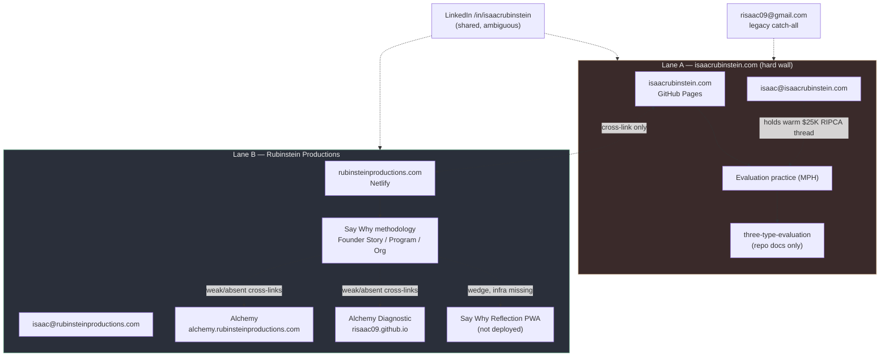
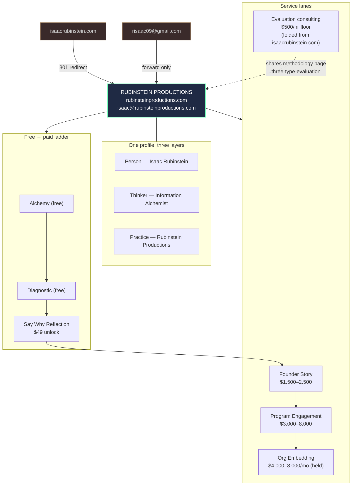
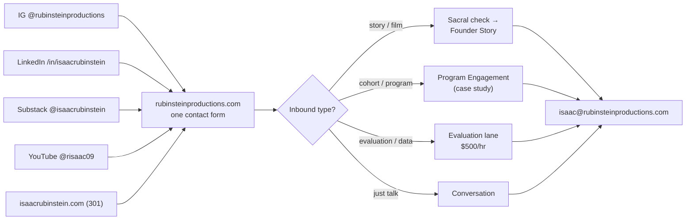
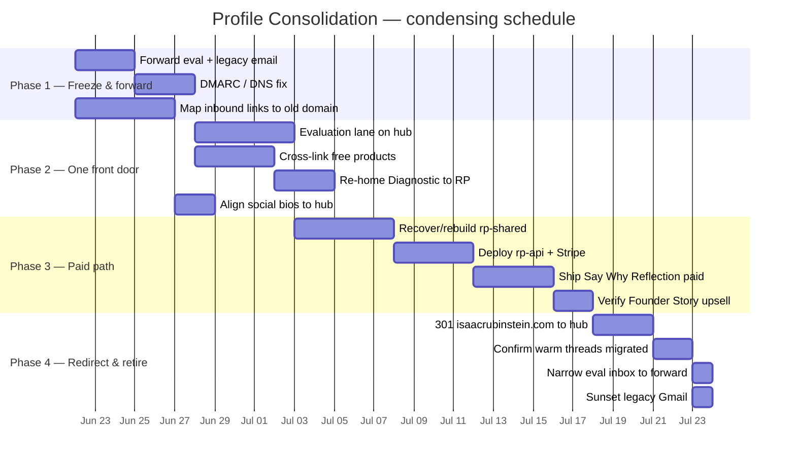

# Profile Consolidation: One Public, Monetizable Profile
*Working Document | Created: 2026-06-17*
*Purpose: Fold Isaac's scattered public identities into a single monetizable profile, with Rubinstein Productions as the canonical hub and `isaac@rubinsteinproductions.com` as the primary contact.*

---

## The directive

Isaac asked for one public, monetizable profile. Today the work lives across two
domains, three email addresses, two design systems, and four products with
different deployment states. The decision is to consolidate everything under
**Rubinstein Productions** and route the primary relationship through
**`isaac@rubinsteinproductions.com`**.

This document does three things:

1. **Process analysis** of the current state, surface by surface.
2. **Process maps and visual schema** of where things are now and where they go.
3. **A condensing schedule** that sequences the consolidation without dropping
   the warm revenue threads that currently live in the secondary lane.

> One tension to hold up front. The brand docs (`prompts/brand-context.md`,
> `prompts/skills/.../DESIGN.md`) describe a deliberate "hard wall" between the
> evaluation identity at `isaacrubinstein.com` and Rubinstein Productions. That
> wall currently protects live money: a warm RIPCA conversation (~$25K) and
> active hiring/consulting threads run through `isaac@isaacrubinstein.com`. The
> directive is to fold the wall down to one profile. The schedule below does that
> by **redirecting and absorbing** the evaluation lane, never by deleting it, so
> no warm thread breaks mid-flight.

---

## 1. Current-state process analysis

### 1.1 Identities and brand names in play

| Identity | What it is | Where it lives | Keep / fold / retire |
|---|---|---|---|
| **Isaac Rubinstein** (person) | The facilitator and filmmaker. The anchor. | Everywhere | Keep as the person behind the hub |
| **Rubinstein Productions** | The practice. Facilitation and film. Service tiers, pricing. | `rubinsteinproductions.com` | **Keep as the canonical hub** |
| **Say Why** | The named methodology (Container, Excavation, Performance, Translation). Not a separate brand. | Toolkit, PWA, grant concept | Keep as methodology under RP |
| **Information Alchemist** | Intellectual umbrella identity for the thinker/theorist work. | `brand-context.md`, Substack | Fold in as the thinker layer of the one profile |
| **Digital Liver** | The intake theory behind the products. | `research/dual-architecture.md` | Keep as theory; surface through products, not as a public brand |
| **Evaluation practice (MPH)** | Independent program-evaluation consulting. | `isaacrubinstein.com`, `three-type-evaluation` | **Fold in** as a service lane under the hub |
| **The Metabolizer** | Retired $29 vault product. | Lineage of Alchemy | Already retired; reference only |

Retired names that must not resurface (per `instantiation-prompt.md`): Voice
Liberation, Consciousness Cartography, Narrative Dysregulation, Generative
Translation, Rhizoanalyst, and the old Mirror/Map/Territory tier names.

### 1.2 Contact surfaces (the fragmentation)

| Surface | Value | Current role | Target role |
|---|---|---|---|
| Email (primary) | `isaac@rubinsteinproductions.com` | RP business | **Primary for everything** |
| Email (secondary) | `isaac@isaacrubinstein.com` | Evaluation/consulting, holds warm leads | Forward to primary, keep alias for replies-in-thread |
| Email (legacy) | `risaac09@gmail.com` | Catch-all, typo-prone | Retire from public use; forward only |
| Domain | `rubinsteinproductions.com` (Netlify) | Business site | **Canonical home** |
| Domain | `isaacrubinstein.com` (GitHub Pages) | Evaluation site, hard wall | Redirect to a `/evaluation` lane on the hub |
| Instagram | `@rubinsteinproductions` | Primary social | Keep |
| LinkedIn | `/in/isaacrubinstein` | Shared by both lanes | Keep; one profile, two service badges |
| Substack | `@isaacrubinstein` | Thinker/essays | Keep; point bio at the hub |
| YouTube | `@risaac09` | Film | Keep; point bio at the hub |
| Phone | `(206) 419-6888` | Career materials | Keep on hub contact |

### 1.3 Products and deployment state

| Product | Live URL | Price today | Links to RP? | Consolidation move |
|---|---|---|---|---|
| **Alchemy** (PWA + Obsidian) | `alchemy.rubinsteinproductions.com` + GH Pages | Free (was $29) | CNAME under RP, but no cross-links | Add hub cross-links; free top-of-funnel |
| **Alchemy Diagnostic** | `risaac09.github.io/alchemy-diagnostic/` | Free | No (off-namespace) | Move under RP namespace; embed on hub |
| **Say Why Reflection** | Not deployed (`saywhy.app` target) | $49 unlock (non-functional) + Founder Story upsell | Strong intent, infra not deployed | Deploy; wire the paid path; the wedge to Founder Story |
| **Three-Type Evaluation** | Repo docs only | None (B2B consulting) | No (walled to `isaacrubinstein.com`) | Surface as the evaluation lane's methodology page |

### 1.4 The monetizable ladder (target)

The pieces already imply a funnel. Consolidation makes it one ladder under one
profile:

- **Free tools** (Alchemy, Diagnostic) draw people in.
- **Say Why Reflection** converts at **$49** (PDF + 30-min call).
- **Founder Story** is the core paid service at **$1,500 to $2,500**.
- **Program Engagement** at **$3,000 to $8,000** runs as a case study, not actively sold.
- **Organizational Embedding** at **$4,000 to $8,000/mo** stays held until one paid Program Engagement closes.
- **Evaluation consulting** (the folded-in lane) runs at the **$500/hr floor**, with the warm RIPCA thread as the first proof point.

Pricing floors are non-negotiable: Founder Story $1,500, Program Engagement
$3,000, Org Embedding $4,000/mo, hourly $500.

---

## 2. Process maps and visual schema

### 2.1 Current state: scattered surfaces

Read: two domains, two emails, a legacy inbox, a shared LinkedIn that points
both ways, products that mostly do not link back to the hub, and the paid path
that was designed but never deployed.

### 2.2 Target state: one hub, clear spokes

### 2.3 The lead-flow after consolidation

---

## 3. Gap and risk analysis

| Gap / risk | Detail | Mitigation in the schedule |
|---|---|---|
| **Warm-thread breakage** | RIPCA (~$25K) and hiring threads live on `isaac@isaacrubinstein.com`. | Forward + alias before any redirect. Reply in-thread from the alias so the other party sees continuity. |
| **Two design systems** | Brand A (Ink/Ochre/Teal, Fraunces) vs Brand B (Digital Liver, EB Garamond). | Pick Brand B as canonical. Give the evaluation lane a sober sub-skin inside it, not a separate system. |
| **Undeployed paid path** | `rp-api` worker has placeholder KV ids and no Stripe secrets; `saywhy.app` does not resolve; `rp-shared` source repo is missing. | Phase 3 stands up infra before any "monetizable" claim is made publicly. |
| **Off-namespace product** | Diagnostic lives on `risaac09.github.io`. | Re-home under `rubinsteinproductions.com` subpath/subdomain. |
| **SEO / reputation on old domain** | `isaacrubinstein.com` carries evaluation credibility and inbound links. | 301 redirect (not teardown) preserves link equity and routes it to the hub. |
| **Brand voice on the consolidated site** | Folding a clinical evaluation voice into a relational film brand risks tone clash. | Keep evaluation copy plain and concrete; honor RP voice rules (no em-dashes, no rule-of-three, no jargon). |
| **DNS/DMARC** | Outreach staging notes a pending DNS fix on the eval domain. | Finish DMARC before redirect so forwarded mail does not land in spam. |

**Decision still owned by Isaac:** is the consolidated public identity framed as
*Isaac Rubinstein, Information Alchemist* (person-first) or as *Rubinstein
Productions* (practice-first)? The schema above leads with the practice as the
hub and carries the person/thinker as layers. Flag if you want person-first.

---

## 4. The condensing schedule

Four phases. Each phase is shippable on its own and does not break the warm
threads. Effort is rough, assuming part-time pace.

### Phase 1 — Freeze and forward (week 1)
Goal: stop the fragmentation from spreading; protect the money.
- Set `isaac@isaacrubinstein.com` to forward to `isaac@rubinsteinproductions.com`, keep send-as alias for in-thread replies.
- Set `risaac09@gmail.com` to forward only; remove it from any public surface.
- Finish DMARC/DNS on the eval domain so forwarded mail authenticates.
- Inventory every live inbound link to `isaacrubinstein.com` (for the redirect map).

### Phase 2 — One front door (weeks 2–3)
Goal: the hub presents the whole profile.
- Add an **Evaluation** page/lane to `rubinsteinproductions.com`, sourced from `three-type-evaluation`.
- Cross-link the free products from the hub (Alchemy, Diagnostic) and add hub links back from each product.
- Re-home Alchemy Diagnostic under the RP namespace (`diagnostic.rubinsteinproductions.com` or `/diagnostic`).
- Align LinkedIn/Substack/YouTube bios to point at the hub. One LinkedIn, two service badges.

### Phase 3 — Stand up the paid path (weeks 4–6)
Goal: make "monetizable" true, not aspirational.
- Recover or rebuild `rp-shared` (worker + design tokens + paywall lib).
- Deploy `rp-api`: real KV namespace ids, Stripe price ids and secrets.
- Deploy Say Why Reflection to `saywhy.app` (or `/reflect` on the hub) with the $49 unlock working end to end.
- Verify the upsell band from Reflection into Founder Story.

### Phase 4 — Redirect and retire (weeks 7–8)
Goal: one domain, one inbox, one profile.
- 301-redirect `isaacrubinstein.com` to the hub (root to `/evaluation`, deep links mapped).
- Confirm all warm threads have migrated; only then narrow the eval inbox to forward-only.
- Final pass: every public surface shows `isaac@rubinsteinproductions.com` and the hub URL.
- Sunset the legacy Gmail from all profiles.

---

## 5. Done means

- One public profile. Every surface points at `rubinsteinproductions.com`.
- One inbox. Every reply leaves from `isaac@rubinsteinproductions.com`, warm threads intact.
- One ladder. Free tools to $49 unlock to Founder Story to the higher tiers, with the evaluation lane folded in at the $500/hr floor.
- The old domain redirects, the legacy Gmail forwards, and nothing is deleted that holds a live relationship.

---

## 6. Public frame and on-camera voice (seed notes)
*Captured 2026-06-17 from Isaac, raw. Not committed language. Taglines stay
unconfirmed until Isaac signs off, per `instantiation-prompt.md`.*

The frame leans **practice-first**: Rubinstein Productions as the hub, with the
thinker identity carried as a subtitle rather than a separate brand. That keeps
the maps in sections 2.2 and 2.3 as drawn.

**Subtitle direction.** Information is the material, alchemy is the verb. Isaac's
phrasing was "chemical information" as a subtitle under Rubinstein Productions,
which sits with the existing "Information Alchemist" identity. Seed forms to
test, none final:
- Rubinstein Productions / Information Alchemy
- Rubinstein Productions / the chemistry of information

**Brand energy.** "Stillness in activity." The Hakuin line about meditation in
the midst of action. Calm presence while the work is moving and the camera is
running.

**On-camera posture.** Mischief and presence. Be a little mischievous when you
interact through the camera, and stay present with folks. This is the warm
opposite of the clinical evaluation register, and it is the reason the folded-in
evaluation lane gets a sober sub-skin under the hub voice rather than its own
cold system (see section 3).

Fragment to hold, not yet placed: "easy love."
